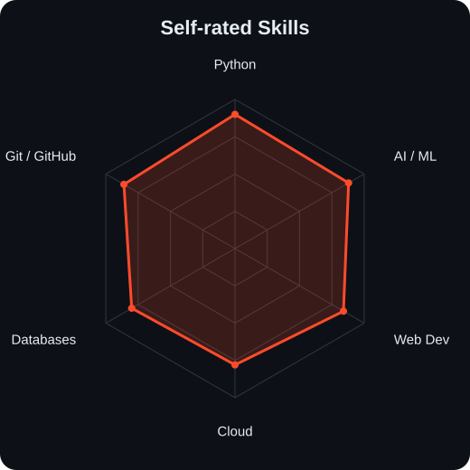
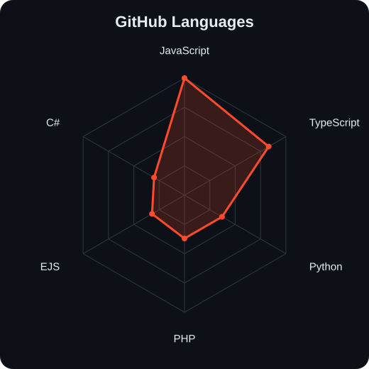
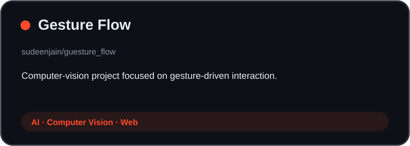
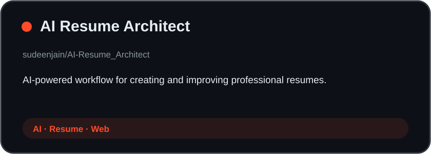
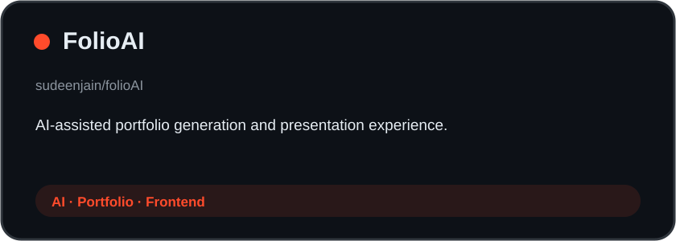
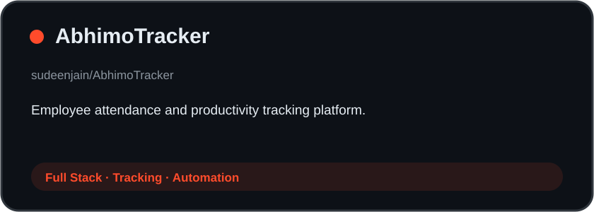
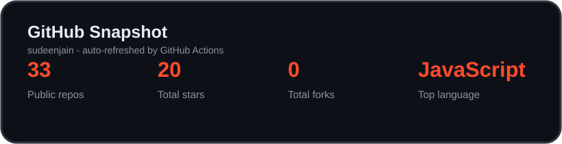

<div align="center">


<br>

<a href="https://github.com/sudeenjain">
  
</a>

<br>

<a href="https://linkedin.com/in/sudeenjain"></a>
<a href="mailto:sudinhr1@gmail.com"></a>
<a href="https://sudeenjain.github.io/portfolio"></a>
<a href="resume.pdf"></a>

<br><br>


</div>

---

## `~/` whoami

```console
$ cat about.txt
```

Hi, I'm **Sudeen Jain H R** — a B.Tech student specializing in **Artificial Intelligence & Machine Learning** at **Srinivas University (2023–2027)**.

I build practical products at the intersection of **AI/ML, full-stack development, cloud computing, and automation**.

- 🤖 Building AI-powered applications and recommendation systems
- 💻 Python, JavaScript, PHP, Java and modern web tooling
- ☁️ Exploring production-ready AI systems and cloud deployment
- 🎓 8 internship experiences and 18+ certifications
- 🚀 Turning side-project ideas into working products

---

<div align="center">

## `~/` toolbox

**Languages & Web**


<br><br>

**AI / ML**


<br><br>

**Cloud & Tools**


</div>

---

<div align="center">

## `~/` skill radar

<table>
<tr>
<td width="50%" align="center">

<picture>
  <source media="(prefers-color-scheme: dark)" srcset="assets/radar/radar-self-dark.svg">
  <source media="(prefers-color-scheme: light)" srcset="assets/radar/radar-self-light.svg">
  
</picture>

</td>
<td width="50%" align="center">

<picture>
  <source media="(prefers-color-scheme: dark)" srcset="assets/radar/radar-langs-dark.svg">
  <source media="(prefers-color-scheme: light)" srcset="assets/radar/radar-langs-light.svg">
  
</picture>

</td>
</tr>
</table>

</div>

---

## `~/` experience

```console
$ ls internships/
```

| Role | Organization |
|---|---|
| AI & Machine Learning Intern | Abhimo Technologies Pvt. Ltd. |
| AI & Machine Learning Intern | Averixis Solutions (AICTE · Google Cloud Partner) |
| Front-End Web Development Intern | Edunet Foundation × IBM SkillsBuild (AICTE) |
| Full Stack Web Development Intern | IBM SkillsBuild |
| Emerging Technologies (AI & Cloud) Intern | Edunet Foundation × IBM |
| UI/UX Design Intern | Snestron Systems Pvt. Ltd. |
| Python Programming Intern | CodSoft |
| Machine Learning Intern | CodSoft |

---

<div align="center">

## `~/` selected work

<table>
<tr>
<td width="50%">
<a href="https://github.com/sudeenjain/guesture_flow">
<picture>
<source media="(prefers-color-scheme: dark)" srcset="assets/projects/guesture_flow-dark.svg">
<source media="(prefers-color-scheme: light)" srcset="assets/projects/guesture_flow-light.svg">

</picture>
</a>
</td>
<td width="50%">
<a href="https://github.com/sudeenjain/AI-Resume_Architect">
<picture>
<source media="(prefers-color-scheme: dark)" srcset="assets/projects/ai_resume_architect-dark.svg">
<source media="(prefers-color-scheme: light)" srcset="assets/projects/ai_resume_architect-light.svg">

</picture>
</a>
</td>
</tr>
<tr>
<td width="50%">
<a href="https://github.com/sudeenjain/folioAI">
<picture>
<source media="(prefers-color-scheme: dark)" srcset="assets/projects/folioai-dark.svg">
<source media="(prefers-color-scheme: light)" srcset="assets/projects/folioai-light.svg">

</picture>
</a>
</td>
<td width="50%">
<a href="https://github.com/sudeenjain/AbhimoTracker">
<picture>
<source media="(prefers-color-scheme: dark)" srcset="assets/projects/abhimotracker-dark.svg">
<source media="(prefers-color-scheme: light)" srcset="assets/projects/abhimotracker-light.svg">

</picture>
</a>
</td>
</tr>
</table>

</div>

---

<div align="center">

## `~/` contribution calendar


<br><br>

<picture>
<source media="(prefers-color-scheme: dark)" srcset="https://raw.githubusercontent.com/sudeenjain/sudeenjain/output/github-contribution-grid-snake-dark.svg">
<source media="(prefers-color-scheme: light)" srcset="https://raw.githubusercontent.com/sudeenjain/sudeenjain/output/github-contribution-grid-snake.svg">

</picture>

</div>

---

<div align="center">

## `~/` the numbers

<picture>
<source media="(prefers-color-scheme: dark)" srcset="assets/stats/github-snapshot-dark.svg">
<source media="(prefers-color-scheme: light)" srcset="assets/stats/github-snapshot-light.svg">

</picture>

<br><br>


<br><br>


</div>

---

<div align="center">

## `~/` achievements


</div>

---

## `~/` certifications

<details>
<summary><b>Open certification list</b></summary>

<br>

- AWS Academy Cloud Foundations
- Prepare Data for ML APIs on Google Cloud
- IT Specialist – Artificial Intelligence
- Deep Learning using TensorFlow
- Introduction to Generative AI Studio
- Introduction to Artificial Intelligence
- Azure Fundamentals
- IBM Web Development Fundamentals
- IBM Journey to Cloud
- IBM Getting Started with AI
- IBM SPSS Modeler
- AWS Solutions Architecture Job Simulation
- IBM Watson Services
- Machine Learning (Intel)
- Infosys Springboard certifications
- Simplilearn SkillUp certifications

</details>

---

<div align="center">

## `~/` connect

**AI & Machine Learning · Full-Stack Development · Cloud · Open Source · Software Engineering**

<br>

<a href="https://linkedin.com/in/sudeenjain"></a>
<a href="https://sudeenjain.github.io/portfolio"></a>
<a href="mailto:sudinhr1@gmail.com"></a>

<br><br>

<sub>`while (alive) { learn(); build(); improve(); }`</sub>

</div>
